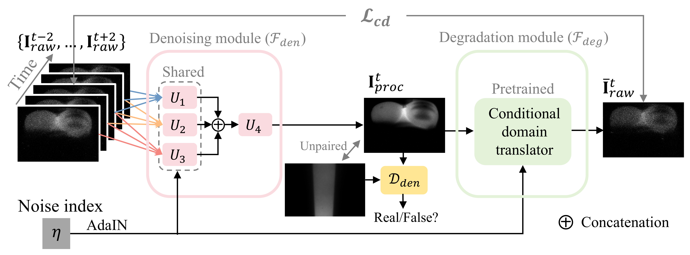
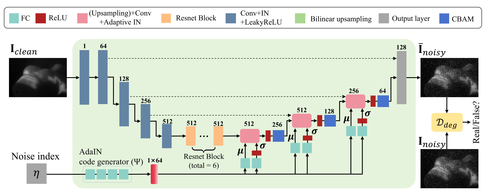

# Non-blind-Self-Supervised-Network-for-Cherenkov-Video-Denoising

Official implementation of:

**From Noise Synthesis to Noise Removal: Non-blind Self-Supervised Cherenkov Video Denoising for Quantitative Verification of Radiotherapy**

---

## Framework

The framework consists of:
### Asymmetric Self-Supervised Cycle Denoising Framework
- 5-frame temporal aggregation
- AdaIN-based noise-prior conditioning
- Cycle-consistent denoising–degradation learning
 
### 2. Architectures of Denoising Sub-networks Ux(x=1,2,3)
- Multi-stage residual feature refinement
- Progressive multi-scale feature extraction
- Noise-aware feature modulation via AdaIN

### 3. Conditional Degradation Translator (`F_deg`)
- Pix2Pix-based image-to-image degradation modeling
- Noise-level conditioned translation
- CBAM-enhanced decoder for spatial–channel attention
- 
---

## Repository Structure

```bash
.
├── Addnoise/
│   ├── Addnoise_model/
│   ├── Dnet/
│   ├── data_argu/
│   ├── losses/   
│   ├── try/
│   └── Unet/
├── Figure/                    
├── data/                   
├── models/                 # Network definitions
│   ├── denoising/
│   ├── degradation/
│   └── discriminator/
├── CEM/
├── CEM_calculation/
├── read_cem/
├── read_cem_self/
├── read_cem_signal/
├── results/
├── train/
├── test/
└── README.md
```

---

## Installation

Create environment:

```bash
conda create -n cherenkov python=3.9
conda activate cherenkov
```

Main requirements:

- Python 3.9+
- PyTorch 2.0+
- CUDA 12.4
- torchvision
- numpy
- opencv-python
- scipy
- visdom
- lpips

---

## Dataset

### Phantom Dataset
Phantom data can be downloaded from the following link:

Baidu Netdisk: [https://pan.baidu.com/s/1HKeHBwsTUbNBS9ORZNroUw?pwd=y2x6]
Extraction code: [y2x6]

Place phantom data under:
```bash
data/phantom/
```

### Clinical Dataset

Due to patient privacy restrictions, clinical datasets are not publicly released.

---

## Training

### Step 1: Pretrained Degradation Module

Instead of training from scratch, you can directly download the pretrained degradation model from the following link:

**Download pretrained model:** [https://pan.baidu.com/s/1uR8hDrCqMT1HCBFHHev9EQ?pwd=7s7h]
Extraction code: [7s7h]

Please place the downloaded checkpoint in the root directory of the project.

### Step 2: Train denoising module

```bash
python train.py
```

### Step 3: CEM Computation

```bash
python CEM_calculation.py
```
---

## Testing

Inference on Cherenkov video:

```bash
python test.py
```

---

